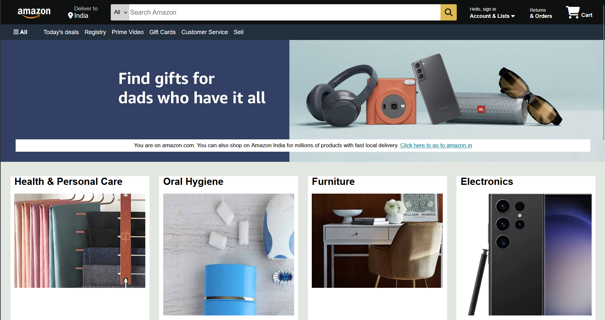

# 🛒 Amazon.com Clone

    This project is a front-end clone of Amazon.com, built entirely using HTML and CSS.
    It was created as a practice project to strengthen my understanding of CSS layouts, styling, and responsive design techniques.

## 📌 Features

    ✅ Amazon-like homepage layout

    ✅ Navigation bar with logo, search bar, and cart icon

    ✅ Product grid section for showcasing items

    ✅ Footer with multiple column layout

    ✅ Responsive design for different screen sizes

## 🛠️ Tech Stack

    HTML5 – for structure

    CSS3 – for styling, positioning, and layout

## 🎯 Learning Outcomes

    Through this project, I practiced:

        Using Flexbox and Grid for complex layouts

        Creating reusable CSS classes

        Implementing responsive web design principles

        Improving pixel-perfect alignment and styling

## 🚀 How to Run

    1. Clone this repository:
        git clone https://github.com/ishivanim/Amazon-Clone.git

    2. Open the index.html file in any modern web browser.

## 📷 Preview

## 📚 Note

This is not an official Amazon project. It is a front-end clone made only for educational and practice purposes.